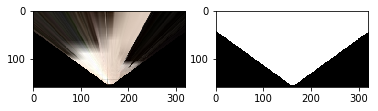
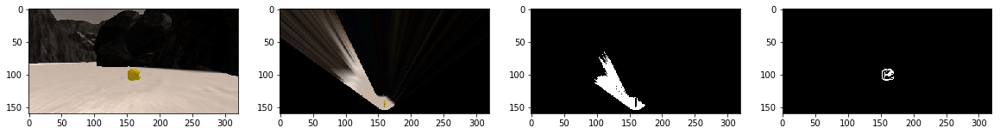

# Rover Sample Return Project
**Writeup for Project 1 - Udacity Robotics Nanodegree** Handed in by Ulrich Ludmann 2017/08/29

## Abstract
The Goal of this Project is to drive a rover around a simulated Environment. The Rover senses the Environment optically with a video camera.
We want to use this camera image to sense the environment and derive appropriate actions.

## Assignments
The following chapter describes how I mastered the project Assignments.
Generally I can say, that I tried really hard to get along without the Project-Walkthrough. But I some cases it was impossible for me to do it without.

### Jupyter Notebook functions

#### Perspective transform
Initially I forgot to implement the masking. After watching the walkthrough, it was clear to me.

Open CV provides us with a function, to transform the images in a new perspective. Fist you need to call **getPerspectiveTransform()** This creates a Matrix that can be fed into the second function.
**warpPerspective()**

```python
M = cv2.getPerspectiveTransform(src, dst)
warped = cv2.warpPerspective(img, M, (img.shape[1], img.shape[0]))# keep same size as input image
mask = cv2.warpPerspective(np.ones_like(img[:, :, 0]), M, (img.shape[1], img.shape[0]))
```

As the image gets transformed, there are many entries in the picture with false information.
In order to generate a map with only these images, we need to determine the valid information in the images. Thats why we need to mask the image. The mask consists of 0 and 1.
+ *0* indicates that there is no valid information in the picture after transformation.
+ *1* indicates valid values.

The following picture shows our camera image after transformation (left image) and the mask (right image).




#### Color thresh
These functions are slightly modified from the functions you provided.
```python
color_select = np.zeros_like(img[:,:, 0])
above_thresh = (img[:,:,0] > rgb_thresh[0]) \
                & (img[:,:,1] > rgb_thresh[1]) \
                & (img[:,:,2] > rgb_thresh[2])
color_select[above_thresh] = 1
return color_select
```
1. First I create a matrix with the same dimensions as the input image
1. Then I search for r, g and b values that are higher than the provided values.
1. Then the zero-matrix gets updated with 1-Values at the positions where rgb values are higher.

Same procedure in obstacle detection.

In the rock detection function, I provide lower and upper thresholds for the color- parameters.

```python
def rock_detection(img, red = (110, 255), green = (90, 255), blue = (0, 80)):
    """
    returns rock filtered image. -> possibility to return nonzero values as well.
    args = img : mp.imgread, red, green blue as tuples (lower_value, upper_value) (0, 255), (90, 175), (0, 80)
    """
    rock_filter = np.zeros_like(img[:, :, 0])
    #parameter definition:
    rot_range = (img[:, :, 0] > red[0]) & (img[:,  :,0] < red[1])
    green_range = (img[:, :, 1] > green[0]) & (img[:,:, 1] < green[1])
    blue_range = (img[:, :, 2] > blue[0]) & (img[:,:, 2] < blue[1])
    rock_range = np.where(rot_range & green_range & blue_range)
    rock_filter[rock_range] = 1
    return rock_filter
```
Finally I search for entries, that match the conditions and fill a matrix with 1, where these conditions are met.

#### Process image function
The purpose of this function is to create a map out of the video stream.

I struggled with the x and y axis (sometimes they were interchanged) and i forgot to implement the mask. So in the beginning the results were really poor. Fortunately now I know.
Also I tried some things while populating  the map.

```python
source = np.float32([[14, 140], [301 ,140],[200, 96], [118, 96]])
destination = np.float32([[image.shape[1]/2 - dst_size, image.shape[0] - bottom_offset],
              [image.shape[1]/2 + dst_size, image.shape[0] - bottom_offset],
              [image.shape[1]/2 + dst_size, image.shape[0] - 2*dst_size - bottom_offset],
              [image.shape[1]/2 - dst_size, image.shape[0] - 2*dst_size - bottom_offset],
              ])
warped, mask = perspect_transform(img, source, destination)
threshed = color_thresh(warped)
obs_map = np.absolute(np.float32(threshed)-1) * mask
x_navi, y_navi = rover_coords(threshed)
obstacles_rover = rover_coords(obs_map)
```
In this function, all methods from above are combined to generate the map.
1. source and destination parametes for the perspective transform are set.
1. the image gets warped and the mask gets generated. (image 2 and 3 below)
1. we color-threshold the navigable terrain and the obstacles. (/or of course rocks.) (image 4.is not warped though.)
1. we transform the images (navigable terrain and obstacles) into rover centric coordinates.



Then we feed the rover centric coordinates into the pix_to_world function to populate the map.
The arguments for the function are received from the Rover instance:

```python
xpos = float(data.xpos[data.count])
ypos = float(data.ypos[data.count])
yaw = float(data.yaw[data.count])
scale = 2 * dst_size
world_size = data.worldmap.shape[0]
```

```python
x_world, y_world = pix_to_world(x_navi, y_navi, xpos, ypos, yaw, world_size, scale)
obsx_pix, obsy_pix = pix_to_world(obstacles_rover[0], obstacles_rover[1], xpos, ypos, yaw, world_size, scale)
```


### decision.py functions


#### perception_step()
I implemented "wall-hugging" by adding a offset to the Rover.steer in line 27.

I implemented a function, that detects, if the rover is stuck.

```python
if Rover.throttle == 0.2 and abs(Rover.vel) < 0.2:
        print("Stuck?")
        if not Rover.start_time_stuck:
            Rover.start_time_stuck = Rover.total_time
        print(Rover.total_time - Rover.start_time_stuck)
        if Rover.total_time - Rover.start_time_stuck > 5:
            Rover.mode = 'stuck'

```
After this detection, the rover performs actions to escacpe this state.

```python
if Rover.mode == 'stuck':
      print(Rover.mode)
      if not Rover.stuck_choice:
          Rover.throttle = -0.2
          Rover.steer = 15
      if len(Rover.nav_angles) >= 2 * Rover.stop_forward and (Rover.total_time - Rover.start_time_stuck) > 13:
              Rover.mode = 'forward'
              Rover.start_time_stuck = None
```

I experimented a lot with rock detection. This works quiet well but i couldn't get the rover to drive near the rock and pick the rock up.

```python
if np.count_nonzero(Rover.vision_image[:,:, 1]) > 40:
      print("ich sehe einen Felsen!")
```

### perception.py functions
Most of the code is explained in the upper section. I edited the mapping so that the rover does only take the near pixels into account and not those, which are more distant to the camera:
```python
sichtweite = 90 # je höher, desto kleiner möglich von 0 bis 160
threshed = color_thresh(warped)[sichtweite:160, :]
obstacles_threshed = np.absolute(np.float32(threshed)-1) * mask[sichtweite:160, :]
Rover.vision_image[sichtweite:160, :, 0] = obstacles_threshed * 255
Rover.vision_image[sichtweite:160, :, 2] = threshed * 255
  ```

Additionally I implemented a function, so that only images are considered to be mapped, as the rover is in a stable driving-state:
```python
if Rover.pitch < 0.3 and Rover.roll < 0.3:
      Rover.worldmap[yworld, xworld, 2] += 10
      Rover.worldmap[obsypix,obsxpix, 0] += 1
```

 This improves the fidelity and its ability to navigate.


## Conclusion
I learned a lot about image processing and of course numpy and python.
It was nice to see that the function, I implemented by myself (is the rover stuck?) worked. Unfortunately I was not able to master this assignment running without the help of the project walkthrough.
I look forward to the next assignment.

* My code is optimized to run in 800x600 resolution and on quality level "good". FPS were between 10 and 30 *
